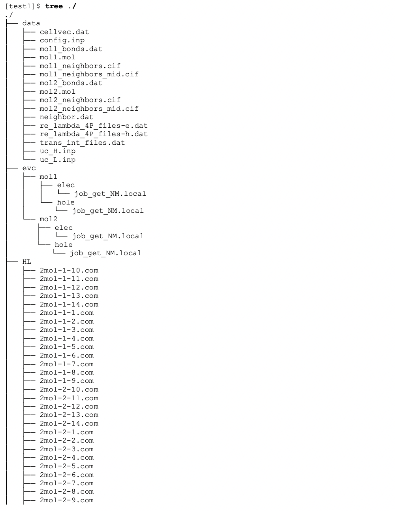
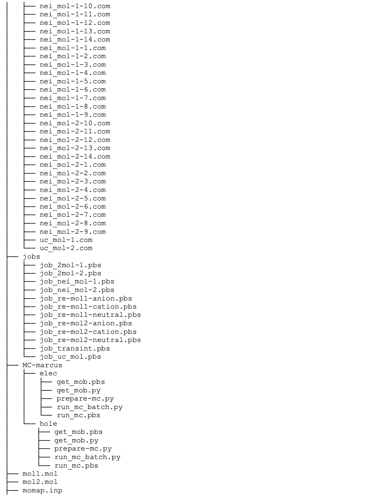
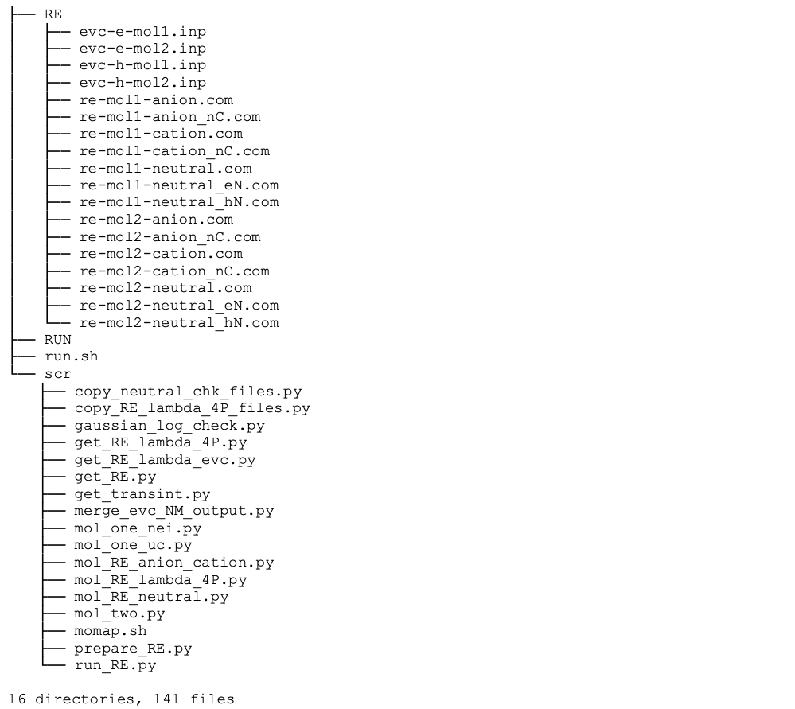

附录
****

In the following part of this guide, we will show you how to obtain the useful calculation results from various QC packages. The 1,4-distyrylbenzene molecule (DSB for short) and Gaussian 09 package are used to demonstrate the process.

The Gaussian 09 is used to do optimization and frequency calculations on the ground state (S0) and the lowest singlet excited state (S1), the transition dipole moment and the transition electric field between S0 and S1 states.

Optimization calculation on ground state (S0)
===============================================

Once the initial geometry is constructed, we have to find the optimized S0 geometry. The route section is set as #p opt b3lyp/6-31g*, which indicates an optimization at B3LYP/6-31G* level.

When the calculation is completed, locate the last line with “SCF Done” in the output *.log file in order to find the single point energy at the optimized S0 geometry. In this example, the last line with “SCF Done” is like the following:

.. code-block:: bash

	SCF Done: E(RB3LYP) = -849.172438992 A.U.

The complete results can be found in directory tests/DSB/opt_and_frequency.

Frequency calculation at the optimized S0 geometry
===================================================

After finding the optimized S0 geometry, we need to verify the optimization result and calculate its force constant matrix via frequency calculation. The route section is set as #p freq b3lyp/6- 31g*, which runs a frequency calculation at the B3LYP/6-31G* level. You have to define the location of *.chk file in Link 0 Commands as well.

Use the Gaussian built-in command formchk to generate a *.fchk file based on the output *.chk. The *.fchk file contains readable force constant matrix information that is needed in dushin calculation.

The complete results can be found in directory tests/DSB/opt_and_frequency.

In this example, the route section is set as #p opt freq b3lyp/6-31g*, which means we run optimization and frequency calculations at the same time. However, we recommend separating them into two types of calculation in order to avoid any possible mistakes.

Transition dipole moment (absorption) at the optimized S0 geometry
=======================================================================

After finding the optimized S0 geometry, we can calculate transition dipole moment (absorption) and vertical excitation energy at this geometry. The route section is set as #p td b3lyp/6-31g*, which runs a calculation at B3LYP/6-31G* level by using the TDDFT method.

When the calculation is completed, find the related information about “Excited State 1” in the output *.log file in order to find the vertical excitation energy and transition dipole moment (absorption) at the optimized S0 geometry. In this example, the information is listed below:

.. code-block:: bash

	Ground to excited state transition electric dipole moments (Au):
	state      X        Y       Z      Dip. S.     Osc.
	   1    -4.6693  -0.0118  0.0112   21.8029    1.7826

	Excited State 1: Singlet-A 3.3372 eV 371.52 nm f=1.7826 <S**2>=0.000 75 -> 76 0.70728 
	This state for optimization and/or second-order correction.
	Total Energy, E(TD-HF/TD-KS) = -848.655200149

Hence, the vertical excitation energy at the optimized S0 geometry is 3.3372 eV, and the transition dipole moment (absorption) can be obtained using Dip. S.:

.. image:: ./img/functional_dipole_moment.png

Optimization calculation on lowest singlet excited state (S1)
================================================================

With the optimized S0 geometry at hand, we can start optimizing S1 geometry using the optimized S0 geometry as the initial structure. The route section is set as #p td opt b3lyp/6-31g*, which indicates an optimization at the B3LYP/6-31G* level using TDDFT method.

When the calculation is completed, locate the last line with “SCF Done” in the output *.log file in order to find single point energy at the optimized S1 geometry. In this example, the last line with “SCF Done” is the following:

.. code-block:: bash

	SCF Done: E(RB3LYP) = -849.165742659 A.U.

Complete results can be found in directory tests/DSB/opt_and_frequency.

Frequency calculation at the optimized S1 geometry
===================================================

After finding the optimized S1 geometry, we need to verify the optimization result and calculate its force constant matrix via frequency calculation. The route section is set as #p td freq b3lyp/6-31g*, which runs a frequency calculation at the B3LYP/6-31G* level using TDDFT method. You have to define the location of *.chk file in Link 0 Commands as well.

Use Gaussian built-in command formchk to generate a *.fchk file based on output *.chk. The *.fchk file contains readable force constant matrix information that is needed in dushin calculation.

The complete results can be found in directory tests/DSB/opt_and_frequency.

Transition dipole moment (emission) at the optimized S1 geometry
=======================================================================

Transition dipole moment (emission) and vertical excitation energy at the optimized S1 geometry are also given when the calculation in section 7.4 is done. Find the relative information about “Excited State 1” in the output *.log file in order to locate the vertical excitation energy and transition dipole moment (emission) at the optimized S1 geometry. In this example, the information is listed below:

.. code-block:: bash

	Ground to excited state transition electric dipole moments (Au):
	state      X        Y       Z      Dip. S.     Osc.
	   1    -5.3165  -0.0242  0.0000   28.2653    1.9597

	xcited State 1: Singlet-?Sym 2.8300 eV 438.11 nm f=1.9597 <S**2>=0.000 75 -> 76 0.71066
	This state for optimization and/or second-order correction.
	Total Energy, E(TD-HF/TD-KS) = -849.061743778

Hence, the vertical excitation energy at the optimized S1 geometry is 2.8300 eV, and the transition dipole moment (emission) can be obtained using Dip. S.:

.. image:: ./img/functional_dipole_moment_emi.png

The complete results can be found in directory tests/DSB/opt_and_frequency.

Adiabatic energy difference between S0 and S1 states
================================================================

The adiabatic energy difference between S0 and S1 states can be calculated using single point energy results from above sections.

In this example, the adiabatic energy difference is:

.. code-block:: bash

	(−849.06174378+849.17423899)*27.2114 eV=3.0122 eV

Transition electric field and NACME at the optimized S1 geometry
================================================================

After finding the optimized S1 geometry, we can calculate transition electric field at this geometry. Then it’s possible to run a dushin calculation with NACME option toggled on.
The route section is set as the following line:

.. code-block:: bash

	#p td b3lyp/6-31g(d) prop=(fitcharge,field) iop(6/22=-4, 6/29=1, 6/30=0, 6/17=2)

When the calculation is completed, copy two output *.log files into a new directory. One is transition electric field *.log file, which is obtained in this section. The other is frequency calculation at the optimized S0 geometry *.log file, which is obtained in section 7.2. Then use get-nacme to start calculating NACME.
The complete results can be found in directory tests/DSB/nacme.

Transport Calculation Files
===============================

The first step of job manager momap.py is to run transport_prepare.exe. When the transport_prepare.exe is run, it will generate quite a few of directories and files.

To demonstrate how the data and directories are arranged for MOMAP transport calculations, we set both control parameters HL_unique_mol and RE_unique_mol to 0 in the momap.inp.

By running the transport_prepare.exe, the screen output is as follows:

.. code-block:: bash

	$ transport_prepare.exe
	****** Perform Transport Preparation...
	Reading config file "momap.inp"...
	Reading crystal file "naphthalene.cif"...
	  Identifier:
	  Spacegroup name: 'P1'
	  Spacegroup operations:
	x,y,z
	Cell lattice a = 8.098
	Cell lattice b = 5.953
	Cell lattice c = 8.652
	Cell lattice alpha = 90
	Cell lattice beta = 124.4
	Cell lattice gamma = 90
	natoms_cif = 36
	First atom: C1 C 0.082321 0.018562 0.328357 ...
	Last atom: H36 H 0.466698 0.795196 0.331298 Unit cell nmols = 2
	Unit cell natoms = 18 18
	Crystal file naphthalene.cif parsing done.
	Make whole molecules...
	molecule 1 COM = 0.000000 0.000000 -0.000000
	molecule 2 COM = 0.500000 0.500000 1.000000 Writing config file "data/config.inp"...
	**** MOMAP Build Neighbor List ****
	  Neighbor rcutoff distance: 4
	  Neighbor search cell (-/+): 3 3 3
	**** End of MOMAP Build Neighbor List ****
	****** MOMAP Transport Preparation Successfully Done.

Then, all the necessary data and directories for MOMAP Transport calculations are prepared. The full directory and file tree is shown in the following pages (in Linux case, as follows, by simply run the tree command):

If control parameter sched_job_array=0 is set in momap.inp, more job scripts will be generated. However, do not be frightened by the sheer number of files, as they are all well-organized.

In data directory, the uc_H.inp and uc_L.inp, input files for HOMO and LUMO determinations, are for internal use only, and may be used to check the correctness of the results. The mol1.mol and mol2.mol are the separated molecular files of a cif file, for example, also can be used to check the correctness of molecule separation.

The file reorg_einternal_files.dat is used for reorganization internal energy calculations for molecules in the unit cell, which is used for the onsite energy calculation if the control parameter lat_site_energy (default to 0) is set to 1 in the momap.inp control file.

The trans_int_files.dat is for transfer integral calculations. The other files have the meaning as the name suggests.

Finally, the config.inp is the configuration file that the system actually uses. In the default settings, we use scheduling job array (sched_job_array = 1), do not include onsite energy (lat_site_energy = 0), output only base mobility plus angular resolved mobilities information (mob_output_level = 2).

For example, if we do not want to output angular resolved mobilities, we can unset the 2nd bit (mob_output_level is a bit-wise setting flag), that is, mob_output_level = 0. The parameter data_mol_output_level is used to control the output of molecular information in data directory, default to 2. It is a bit-wise control parameter, the 1st bit corresponding to output for the 1st molecule, 2nd bit to output for all molecules, 3rd bit to output for the supercell cif file, and 4th bit to output for the Gaussian oniom input files. All the bit setting can be combined, for example, to output all information, we can set the parameter to 1+2+4+8 = 15, that is , data_mol_output_level = 15.

The evc directory is a work directory for reorganization energy related calculations, which uses data from the RE directory to do the calculations.

The HL directory is for transfer integral calculations. The naming convention is as follows:

* The “uc_mol-” prefix is for single molecule in the central unit cell, thus the uc_mol-1.com and uc_mol-2.com are two Gaussian 
  input files for the central unit cell.

* The “nei_mol-” prefix is for single molecule in the neighbor unit cells, say, nei_mol-1- 6.com means the 6th neighbor molecule 
  (the specific cell index is specified in the neighbor.dat file) of the 1st molecule in the central unit cell.

* The “2mol-” prefix is for two-molecule-pair (dipole), say, 2mol-1-12.com, which means the 1st molecule in the central unit cell 
  and the 12th neighbor molecule of this 1st molecule in central cell are combined to form the Gaussian input file.
