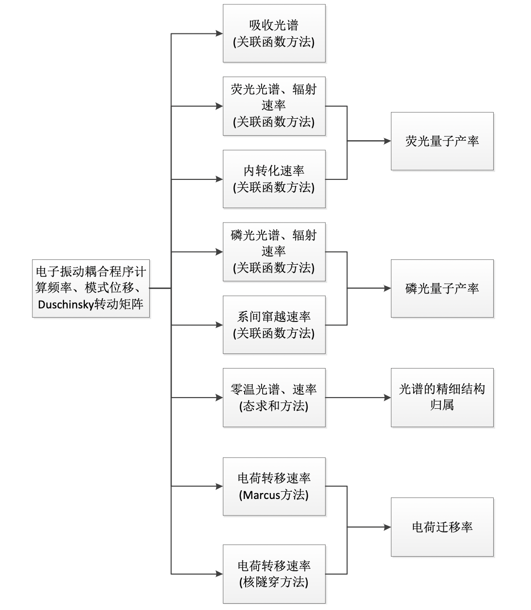

软件概括
=======

MOMAP简介
--------
MOMAP(MOlecular MAterials Property Prediction Package)是一套从理论 上分析、预测有机分子材料光电性能的软件，由清华大学帅志刚教授课题组、中国科学院化学研究所有机固体实验室理论组和鸿之微科技(上海)股份有限公司联合开发完成。MOMAP 涵盖了从分子激发态的 结构到速率过程、多类材料的电荷迁移率和热电优质、光伏材料的光电流-电压 与功率转换效率等性能的计算预测。目前 MOMAP 的主要功能包括分子发光性能以及电荷输运性能的理论计算。

发光性能
-------

对于分子的发光性能，MOMAP主要能够基于第一性原理计算的结果(包括基态、激发态的平衡位形、振动频率和振动模式)，在一阶微扰和费米黄金规则基础上，以及热振动关联函数的理论框架下，计算考虑 Herzberg-Teller 效应的分子吸收、荧光光谱、磷光光谱、辐射速率、内转换速率、 系间窜越速率。在计算光谱和速率之前，首先要通过其他量化软件优化分子基态、激发态的平衡构型，并计算相应构型下的跃迁偶极矩及其导数、非绝热耦 合向量、自旋轨道耦合常数以及振动频率和振动正则模式。根据 Franck-Condon 原理，电子态跃迁瞬时，原子核位形不变，由此得到基态和激发态正则模式之间 的关系表达式为:

.. math ::
    Q{_e} = SQ{_g} + D

其中 :math:`Q{_g}`, :math:`Q{_e}` 分别为基态和激发态的正则坐标，S 为 Duschinsky 转动矩阵，D 为模式位移。根据计算得到的 S 和 D，以及绝热激发能、跃迁偶极矩、非绝热耦合向量和自旋轨道耦合常数等参数，可以进一步计算各个光谱和速率的热振动关 联函数 ρ(t,T)，其中 t 为演化时间，T 为温度。对热振动关联函数进行傅里叶变换，就可以得到吸收、发射光谱和无辐射跃迁的谱函数。辐射速率即等于发射光谱对频率的积分。而无辐射速率即为无辐射谱函数的自变量为“绝热激发能”时的取值。

电荷输运
-------

在载流子输运方面，分子晶体的堆积方式决定了近邻分子之间的电荷转移积分和载流子迁移的网络拓扑结构。我们在给定分子晶体位形的基础上，基于量子化学程序包计算得到的近邻分子间的电荷转移积分，采取 Marcus 公式以及核隧穿方法，在电荷随机行走的理论框架下，采用蒙特卡罗统计方法，综合考虑了近邻载流子转移速率和分子网络拓扑结构效应，发展了一套分子晶体载流子迁移率的理论计算程序，为分子材料载流子输运性能分析提供强有力的理论工具。

MOMAP软件首先构建分子晶体超包，并计算最近邻分子之间的电荷转移积分，基于Marcus公式以及核隧穿方法计算载流子迁移速率，再根据此速率，在电荷随机游走的理论框架下，采用模特卡罗统计方法，计算材料各方向上的迁移率.

软件功能结构
-----------

软件功能结构如下图所示，软件能够根据其他量化软件计算得到分子基态、激发态信息，利用电子―振动耦合程序计算频率、模式位移、Duschinsky 转动矩阵，为接下来的计算做准备。软件所需的分子基态、激发态信息主要包括:分子 在基态以及激发态的平衡构型、能量、振动模式以及两个电子态之间的跃迁偶极矩、非绝热耦合向量、自旋轨道耦合常数、转移积分等。可通过目前成熟的量化 软件(例:Gaussian、Turbomole、NWChem、Dalton、BDF 等)计算得到。

基于电子―振动耦合程序的结果，用户能够利用软件内各种程序计算分子吸收光谱、荧光光谱、磷光光谱、辐射速率、内转换速率、系间窜越速率以及电荷 转移速率，并以此最终定量的得到分子的荧光、磷光的量子产率以及迁移率。

.. _清华大学帅志刚教授课题组: http://www.shuaigroup.net/
.. _股份有限公司: https://iresearch.net.cn/