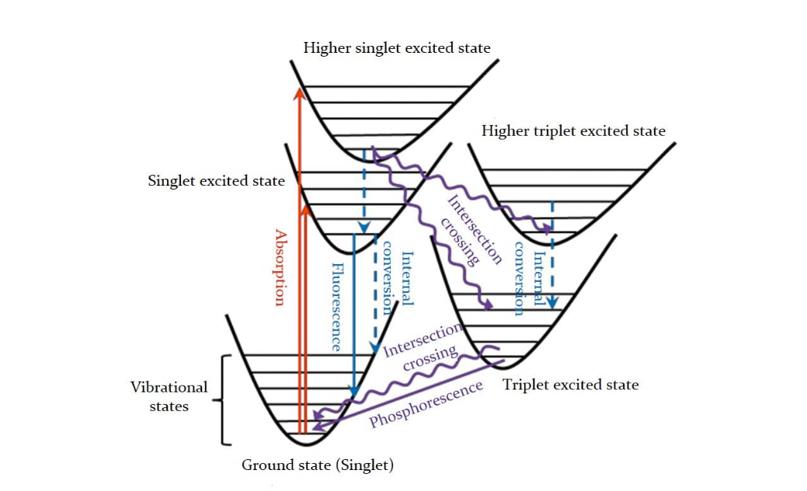
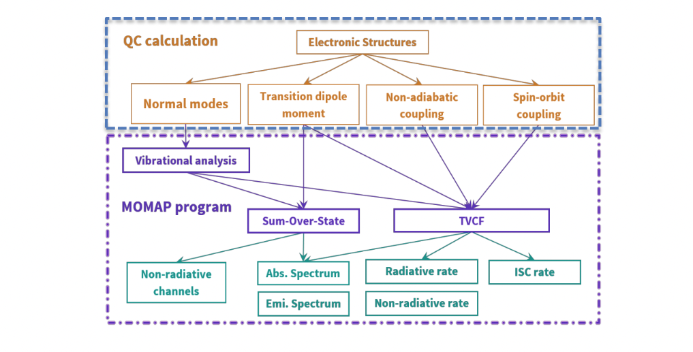
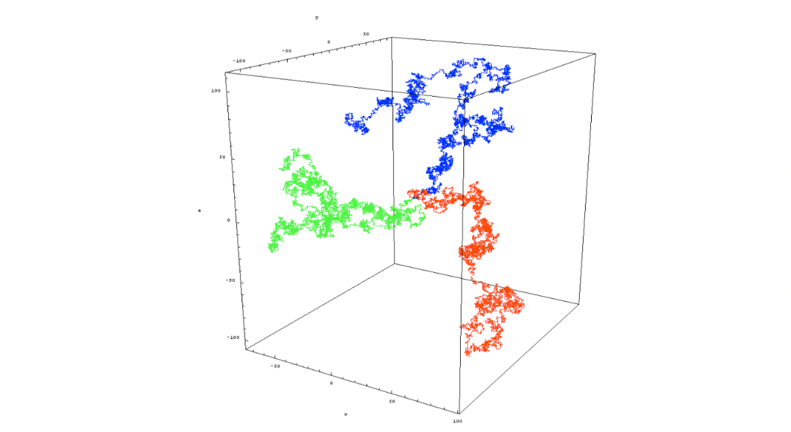
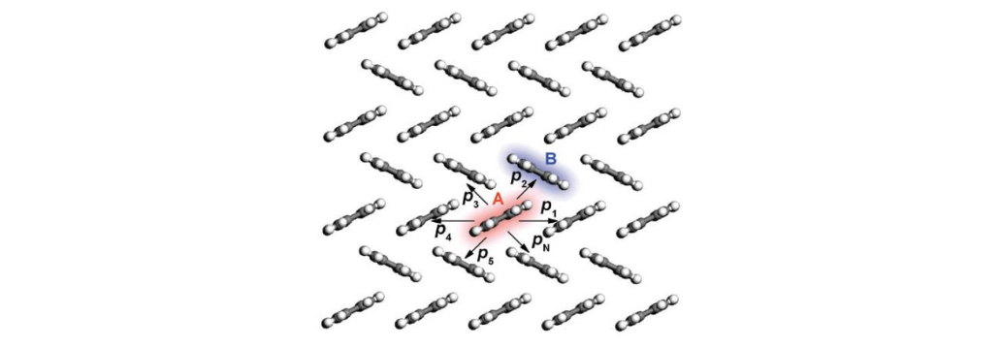
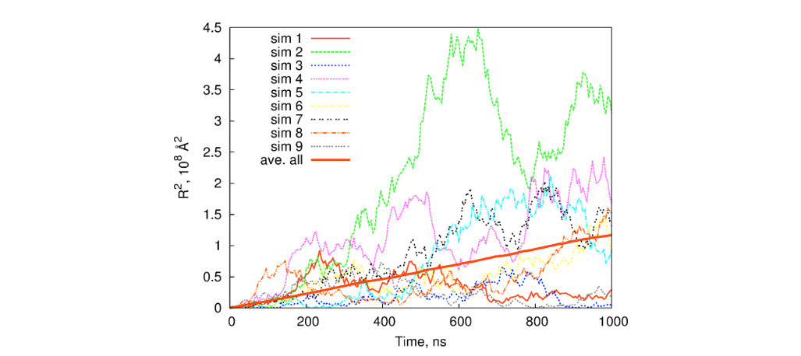

理论背景
*******

发光性能
========
The excitation, radiative decay and non-radiative decay are the basic photophysical and photochemical processes. They all have direct impact on the optical and electrical properties of a molecule.

The key photophysical processes, which can be described by Jablonski energy diagram, as shown below. MOMAP can simulate the spectrum of a given molecule, including the absorption, fluorescence and phosphorescence spectrum. In addition, MOMAP is also able to calculate transition rate constants between two electronic states as well, including the radiative and non-radiative decay rate constants for the internal conversion (IC) process and intersystem crossing (ISC) process.

As we know, the photophysical properties are tightly related to the various properties of ground and excited states, which are the basis to carry out calculations in MOMAP. The various module dependencies on common quantum chemistry (QC) calculations are shown below

In order to perform the calculation, including geometries, single point energy and vibrational modes of ground and excited states, as well as transition dipole moment, non-adiabatic coupling and spin-orbit coupling constant between ground and excited states, some key information should be provided to MOMAP. This information can be obtained from many other sophisticated quantum chemistry calculation packages, such as Gaussian, Q-Chem, TURBOMOLE, NWChem, ORCA, Dalton, ADF and BDF etc. The calculation details will be given in the following chapters.

电荷输运
========

1. Charge Transfer Rate
-----------------------

Due to the weak coupling between molecules, the charge transport in most organics is dominated by the hopping mechanism, which implies that the transport dynamics can be decomposed into elementary charge transfer processes between different pairs of molecules. The charge transfer between two molecules, Mi and Mj, is a charge exchange reaction. The initial and final states are MʹiMj and MiMʹj, where Mʹ denotes the charge on molecule M. The widely used charge transfer rate from the classical Marcus theory reads

Here, Vij is the transfer integral between the initial and final states, λ is the reorganization energy which is defined as the energy change associated with the geometry relaxation during the charge transfer, and ∆G0 is relevant change of total Gibbs free energy. In molecular semiconductors with only one kind of ij molecules, ∆G0ij equals to zero, and then the Marcus rate becomes

.. math:: H_{ij} = \frac{\partial^2E}{\partial{}R_i\partial{}R_j}

Thereby, the charge transfer is actually a thermal activation process over a barrier of λ/4. The Marcus rate is most appropriate when (1) the temperature is high, (2) the molecules are in equilibrium in both the initial and final states, and (3) the intermolecular diabatic couplings are weak. [3]

2. Pauli Master Equation
--------------------------

When the charge transfer rates are defined, the charge transport dynamics can be characterized by the Pauli master equation (PME) with a Markov assumption. [4] It describes the time evolution of the electron population on each state with a set of purely classical kinetic equations,

where Pi is the occupation number of the charge to be on molecule i, and kij is the charge transfer rate from molecule i to j. Namely, the population change on state i is the difference between the total population transfer from other states to state i and that from state i to other states. The PME can be solved directly through an iterative numerical scheme. One needs to set the initial populations on all states and solve the differential equations to get the charge distribution at any time t. Alternatively, one may use a kinetic Monte Carlo (KMC) algorithm with a series random walk trajectories. [5] In comparison, the KMC approach is numerically more efficient for large systems as converged results can be generally obtained with a sampling of acceptable number of trajectories.

3. Monte Carlo Simulation
--------------------------

The concept of Monte Carlo was first proposed by Stanislaw Ulam in the 1940s. Ulam was a mathematician who worked on the Manhattan Project. Initially, the method was derived to solve the problem of determining the average distance neutrons would travel through various materials. The method was named after the Monte Carlo Casino in Monaco since the randomness of the outcomes that is crucial to games such as roulette or dices is essential for Monte Carlo simulations.

The main ideas behind the Monte Carlo simulation are the repeated random sampling of inputs of the random variable and the aggregation of the results. The variable with a probabilistic nature is assigned a random value. The model is then calculated based on the random value. The result of the model is recorded, and the process is repeated. Usually, the process is repeated hundreds or thousand times. When the simulation is complete, the results can be averaged to determine the estimated value.

4. Lattice Random Walk
--------------------------

Random walk is a typical kind of Monte Carlo process. Using a regular lattice as an illustration, at each step the location jumps to another site according to some probability distribution. In a simple random walk, the location can only jump to neighboring sites of the lattice, forming a lattice path, as show below.

For a particle in a known fixed position at t = 0, the central limit theorem tells us that after a large number of independent steps in the random walk, the walker's position is distributed according to a normal distribution of total variance:

where t is the time elapsed since the start of the random walk,  is the size of a step of the random walk, and t is the time elapsed between two successive steps. This corresponds to the Green function of the diffusion equation that controls the Wiener process, which suggests that, after a large number of steps, the random walk converges toward a Wiener process (a stochastic process with similar behavior to Brownian motion, sometimes the Wiener process is called “Brownian motion”). In three dimensions, the variance corresponding to the Green's function of the diffusion equation is:

By equalizing this quantity with the variance associated to the position of the random walker, one obtains the equivalent diffusion coefficient to be considered for the asymptotic Wiener process toward
which the random walk converges after a large number of steps:

where n = 1, 2, or 3 is the dimensionality of the system under investigation.

5. Charge Carrier Mobility
-----------------------------

The mobility of a charge carrier is related to the diffusion coefficient by the Einstein relationship:

.. image:: ./img/f_t_7.png

Rearrange the above equation, we have:

Thus, the task is to first find the diffusion coefficient of a charge carrier, then the mobility of charge carrier is obtained by using the Einstein relationship. [1] To fulfil the task, we can resort to Monte Carlo simulations. In detail, an arbitrary molecular site in the bulk system is initially chosen as the starting position for the charge. The charge then has a probability of pi to hop to the i-th neighbor (see Figure 2). In practice, in order to determine the next site of the charge in a statistical sense, a random number ξ uniformly distributed between 0 and 1 is generated. If ∑b-1 pi < ξ < ∑b pi, the charge hops to the b- i=1 i=1 th neighbor with a hopping time 1/kb, which assumes no correlation between the hopping events along different pathways. The simulation continues until the diffusion distance exceeds the lattice constant by at least 2–3 orders of magnitude. This process is repeated for thousands of times and averaged to get a linear relationship between the mean-square displacement (MSD) and the simulation time.

Schematic representation of the charge hopping pathways from molecule A to its neighbors with probabilities p1, p2, ..., and pN.

The diffusion coefficient D is calculated through

where n = 1, 2, or 3 is the dimensionality of the system under investigation.

In MOMAP Transport package, we setup a lot of initial different (random) seeds, record the tracks, and then average over the tracks. Even though an individual track looks rather jittery, however, when a certain number of (say 2,000) tracks are averaged, we can get a pretty linear averaged line (thick red line), as shown in the following figure:

With the averaged track, we can fit to a linear line, obtain the diffusion coefficient, and then the charge carrier mobility.

